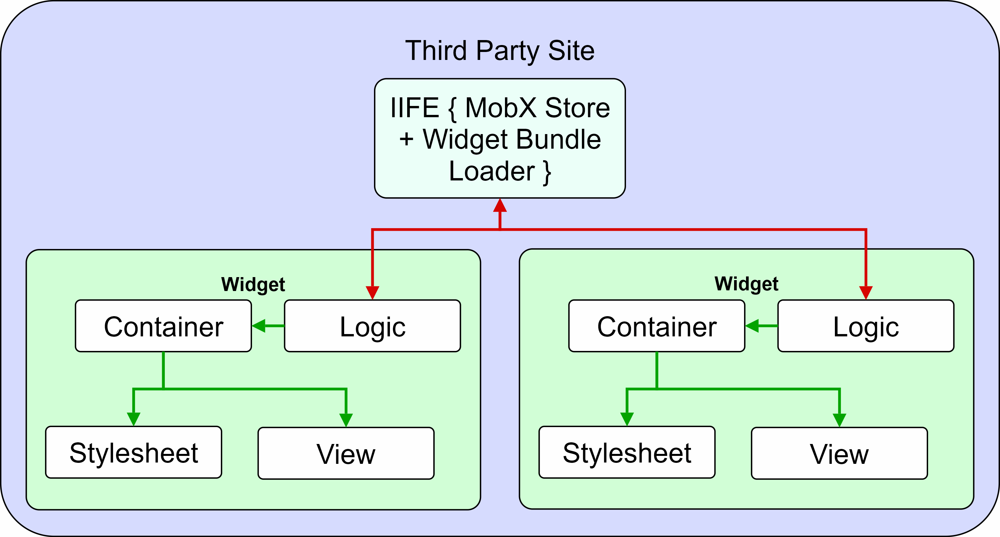

# Shared Store React Apps    

## Contents
[Introduction](#introduction)    
[&nbsp;&nbsp;&nbsp;&nbsp;&nbsp;&nbsp; ◊ Technology Stack](#technology-stack)    
[&nbsp;&nbsp;&nbsp;&nbsp;&nbsp;&nbsp; ◊ Local Stores vs One Global Store](#local-stores-vs-one-global-store)    
[Objectives](#objectives)    
[Application Structure](#application-structure)    
[Dev Environment Setup](#dev-environment-setup)    
[Potential Expansion Objectives](#potential-expansion-objectives)    

## Introduction
The purpose of this project is to investigate the potential for driving multiple React Apps from a single MobX Store.

### Technology Stack
- [React 15](https://github.com/facebook/react)
- [MobX](https://github.com/mobxjs/mobx)

```
npm install react react-dom mobx mobx-react --save
```

- [Webpack -D](http://webpack.github.io/docs/installation.html#use-webpack-in-a-project)
- [Babel-Loader -D](https://github.com/babel/babel-loader)
    - [babel-preset-es2015 -D](https://babeljs.io/docs/plugins/preset-es2015/)
    - [babel-preset-react -D](http://babeljs.io/docs/plugins/preset-react/)
- [Post-CSS -D](https://github.com/postcss/postcss#postcss---)
    - [Pre-CSS -D](https://github.com/jonathantneal/precss)
    - [Autoprefixer -D](https://github.com/postcss/autoprefixer)
- [CSS-Loader -D](https://github.com/webpack/css-loader)
- [Style-Loader -D](https://github.com/webpack/style-loader)
- [File-Loader -D](https://github.com/webpack/file-loader)
- [URL-Loader -D](https://github.com/webpack/url-loader)

```
npm install webpack babel-loader babel-preset-es2015 babel-preset-react postcss autoprefixer precss css-loader style-loader file-loader url-loader --save-dev
```

[Back to the Top](#contents)    

### Local Stores vs One Global Store
Below are the benefits and problems associated with using a local store for each application vs using a global store for all applicatons.    
**BENEFITS**    
- Separation of concerns in very basic applications where state is not shared

**PROBLEMS**    
- Will result in one or more of the following :
    - The duplication of shared state
    - Cross-application dependencies regarding shared state
    - Split state trees that reduce the predictability of structure in applications

- Rigid application structures that require changes in multiple locations when refactoring

- Opens up more potential for code rot

[Back to the Top](#contents)    

## Objectives
Below are the primary objectives of this project as bullet points :

- Inject multiple React applications into a third party site.    

- Distribute state through each React application using Context.
>As the MobX store will be global, Context may not be required

- All applications should be Router-Less    
>The upgrade to multiple routed applications can be an expansion objective

- When a React application's componentWillMount() function invokes :
    - Relevant Action Creators will trigger establishing the initial state for the component in the Global MobX store.

- When a React application's componentWillUnmount() function invokes :
    - Relevant Action Creators will trigger deleting() state exclusively associated with the application from the Global MobX store.

[Back to the Top](#contents)    

## Application Structure


Each application will pass in the MobX Store via Context from the **High Order Component**.    
>Only passing parts from the MobX Store used by an application may not provide any major benefits to performance due to how MobX works.

>Taking this approach will only result in more rigid applications that require additional refactoring to maintain the State Re-Shaping process

[Back to the Top](#contents)    

## Dev Environment Setup
When creating a new React application, a webpack config file that extends the base config will be included in the root directory. A unique NPM Script will launch using an alias that matches the target React application.
>e.g.    
**React App Name** : show-name-widget    
**NPM Scripts** :
```javascript
"scripts": {
    "DevbundleShowNameWidget": "webpack --config Features/ShowNameWidget/ShowNameWidgetDevConfig.js --watch",
    "ProdbundleShowNameWidget": "NODE_ENV=production && webpack --config Features/ShowNameWidget/ShowNameWidgetProdConfig.js"
}
```    

Both **ShowNameWidget** config files will import the base config file and proceed to extend as needed. The benefit to this approach will become more apparent when there are lots of React apps associated with a project. Developers working on a specific widget are able to quickly run a build by prefixing the directory name with **Devbundle** or **Prodbundle**.

[Back to the Top](#contents)    

## Potential Expansion Objectives
The following objectives are listed as potential expansion upon the completion of the main project. Their viability is subject to change based upon the outcomes of the main project.    

- Use [pushState Routing](https://developer.mozilla.org/en-US/docs/Web/API/History_API) to control the current state of multiple applications on the same page.    

[Back to the Top](#contents)    
