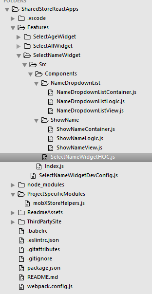
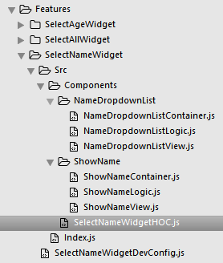

# Shared Store React Apps    

## Contents
[Introduction](#introduction)    
[&nbsp;&nbsp;&nbsp;&nbsp;&nbsp;&nbsp; ◊ Technology Stack](#technology-stack)    
[&nbsp;&nbsp;&nbsp;&nbsp;&nbsp;&nbsp; ◊ Local Stores vs One Global Store](#local-stores-vs-one-global-store)    
[Objectives](#objectives)    
[Application Structure](#application-structure)    
[Dev Environment Setup](#dev-environment-setup)    
[Potential Expansion Objectives](#potential-expansion-objectives)    
[Project Specific Modules](#project-specific-modules)    
[&nbsp;&nbsp;&nbsp;&nbsp;&nbsp;&nbsp; ◊ MobX Store Helpers](#mobx-store-helpers)    

## Introduction
The purpose of this project is to investigate the potential for driving multiple React Apps from a single MobX Store.

### Technology Stack
- [React 15](https://github.com/facebook/react)
- [MobX](https://github.com/mobxjs/mobx)

```
npm install react react-dom mobx mobx-react --save
```

- [Webpack -D](http://webpack.github.io/docs/installation.html#use-webpack-in-a-project)
- [Babel-Loader -D](https://github.com/babel/babel-loader)
    - [babel-preset-es2015 -D](https://babeljs.io/docs/plugins/preset-es2015/)
    - [babel-preset-react -D](http://babeljs.io/docs/plugins/preset-react/)
- [Post-CSS -D](https://github.com/postcss/postcss#postcss---)
    - [Pre-CSS -D](https://github.com/jonathantneal/precss)
    - [Autoprefixer -D](https://github.com/postcss/autoprefixer)
- [CSS-Loader -D](https://github.com/webpack/css-loader)
- [Style-Loader -D](https://github.com/webpack/style-loader)
- [File-Loader -D](https://github.com/webpack/file-loader)
- [URL-Loader -D](https://github.com/webpack/url-loader)
- [http-server -D](https://www.npmjs.com/package/http-server)

```
npm install webpack babel-loader babel-preset-es2015 babel-preset-react postcss autoprefixer precss css-loader style-loader file-loader url-loader --save-dev
```

[Back to the Top](#contents)    

### Local Stores vs One Global Store
Below are the benefits and problems associated with using a local store for each application vs using a global store for all applicatons.    
**BENEFITS**    
- Separation of concerns in very basic applications where state is not shared

**PROBLEMS**    
- Will result in one or more of the following :
    - The duplication of shared state
    - Cross-application dependencies regarding shared state
    - Split state trees that reduce the predictability of structure in applications

- Rigid application structures that require changes in multiple locations when refactoring

- Opens up more potential for code rot

>To prevent worrying about having a nameSpaced Global store object such as `let mobXGlobalStore = {};`, an NPM Script could be used to bundle all applications loading on a page into a single file and placing the Global store at the top.

>For instance, wrapping all applications loading on a page into an IIFE and having the **mobXGlobalStore** inside the IIFE but outside the scope of individual applications.

```
(function() {
    var mobXGlobalStore = {};

    (function() {
        // SelectNameWidget
    })();

    (function() {
        // SelectAgeWidget
    })();

})();
```

[Back to the Top](#contents)    

## Objectives
Below are the primary objectives of this project as bullet points :

- Inject multiple React applications into a third party site.    

- Distribute state through each React application using Context.
>As the MobX store will be global, Context may not be required

- All applications should be Router-Less    
>The upgrade to multiple routed applications can be an expansion objective

- When a React application's componentWillMount() function invokes :
    - Relevant Action Creators will trigger establishing the initial state for the component in the Global MobX store.

- When a React application's componentWillUnmount() function invokes :
    - Relevant Action Creators will trigger deleting() state exclusively associated with the application from the Global MobX store.

[Back to the Top](#contents)    

## Application Structure
    

Each widget has a dev and prod webpack config at the root directory. This config file targets the Index.js which contains a ReactDOM.render() function.   
    

A Higher order Component (HOC) is used to combine the primary components inside a widget.
>This could be replaced by a Pod (View, Stylesheet, Actions) but since it's unlikely to have any functionality other than composing the widget's components. a View is more than sufficient.    
    

Each component contains a **View**, **Display**, **Actions** and **Stylesheet** file. Child components should be nested in a namespaced directory using the same pattern as their parent.    
    

The MobX global store should be accessible from within the HOC and View Components. The approach to achieve this result will be to introduce the MobX Observable store at a level available throughout the entire Third Party Site i.e <body> or similar.

There should be no performance cost making the entire MobX store available like this due to how MobX works (will need testing).

>The alterative; passing sections of the full store into relevant components will result in more rigid applications that require additional refactoring to maintain the State Re-Shaping process.

[Back to the Top](#contents)    

## Dev Environment Setup
When creating a new React application, a webpack config file that extends the base config will be included in the root directory. A unique NPM Script will launch using an alias that matches the target React application.
>e.g.    
**React App Name** : SelectNameWidget    
**NPM Scripts** :
```javascript
"scripts": {
    "DevbundleSelectNameWidget": "webpack --config Features/SelectNameWidget/SelectNameWidgetDevConfig.js --watch",
    "ProdbundleSelectNameWidget": "NODE_ENV=production && webpack --config Features/SelectNameWidget/SelectNameWidgetProdConfig.js"
}
```    

Both **SelectNameWidget** config files will import the base config file and proceed to extend as needed. The benefit to this approach will become more apparent when there are lots of React apps associated with a project. Developers working on a specific widget are able to quickly run a build by prefixing the directory name with **Devbundle** or **Prodbundle**.

[Back to the Top](#contents)    

## Potential Expansion Objectives
The following objectives are listed as potential expansion upon the completion of the main project. Their viability is subject to change based upon the outcomes of the main project.    

- Use [pushState Routing](https://developer.mozilla.org/en-US/docs/Web/API/History_API) to control the current state of multiple applications on the same page.    

- Include an example [here](#project-specific-modules) for each helper function in the [extricated module](ProjectSpecificModules/mobXStoreHelpers.js).
>In either scenario, if as a library you could publish the helpers with documentation as an NPM Package or use path.resolve in webpack : http://stackoverflow.com/a/27512914/4181923    

```
var path = require('path');

resolve: {
    root: path.resolve('./mydir'),
    extensions: ['', '.js']
}
```

- Update component structures where needed to ensure that a separate view/display/actions/stylesheet are associated with the retrieval and presentation of collections of data (a list of todo tasks).
https://mobxjs.github.io/mobx/best/react-performance.html    

[Back to the Top](#contents)    


## Project Specific Modules
The following are project specific modules which are imported / required as though they were npm modules by using Webpack's resolve.root feature.

### MobX Store Helpers
MobX Store Helpers are functions specific to maintaining the MobX Global Store.

**List of Functions**    
[checkStoreForProp](#checkstoreforprop)    
[checkIsPropInUseByComponent](#checkispropinusebycomponent)    
[checkIsPropInUse](#checkispropinuse)    
[setPropInUseForComponent](#setpropinuseforcomponent)    
[unsetPropInUseForComponent](#unsetpropinuseforcomponent)    
[addPropToStore](#addproptostore)    
[removePropFromStore](#removepropfromstore)    

#### checkStoreForProp
Checks the store for a specific property    
>@param1 {object} storeLocation - object being used as the store    
>@param2 {string} propName      - check the store to see if this property exists    
>@return {bool}                 - returns true if the property exists in the store    

[Back to Function List](#mobx=store-helpers)    

#### checkIsPropInUseByComponent
Checks if the given component is using a specific property    
>@param1 {object} storeLocation - object being used as the store    
>@param2 {string} propName      - check the "inUse" value for this prop    
>@param3 {string} componentName - value to check for    
>@return {bool}                 - returns true if the property is being used    

[Back to Function List](#mobx=store-helpers)    

#### checkIsPropInUse
Checks if a specific property is "inUse" by any components    
>@param1 {object} storeLocation - object being used as the store    
>@param2 {string} propName      - check the "inUse" value for this prop    
>@return {bool}                 - returns true if the property is being used    

[Back to Function List](#mobx=store-helpers)    

#### setPropInUseForComponent
Add a specific component to the "inUse" array    
>@param1 {object} storeLocation - object being used as the store    
>@param2 {string} propName      - check the "inUse" value for this prop    
>@param3 {string} componentName - value to push into the "inUse" array    

[Back to Function List](#mobx=store-helpers)    

#### unsetPropInUseForComponent
Removes a specific component from the "inUse" array    
>@param1 {object} storeLocation - object being used as the store    
>@param2 {string} propName      - target the "inUse" value for this prop    
>@param3 {string} componentName - value to remove from the "inUse" array    

[Back to Function List](#mobx=store-helpers)    

#### addPropToStore
Adds a new state property (object) to the MobX Store    
>@param1 {object} storeLocation - object being used as the store    
>@param2 {string} propName      - name used to reference state being added    
>@param3 {object} propValue     - state object being added    
>@param4 {string} componentName - first component using the new state object    

[Back to Function List](#mobx=store-helpers)    

#### removePropFromStore
Removes an existing state property (object) from the MobX Store    
>@param1 {object} storeLocation - object being used as the store    
>@param2 {string} propName      - name used to reference state being removed    

[Back to Function List](#mobx=store-helpers)    

[Back to the Top](#contents)    
